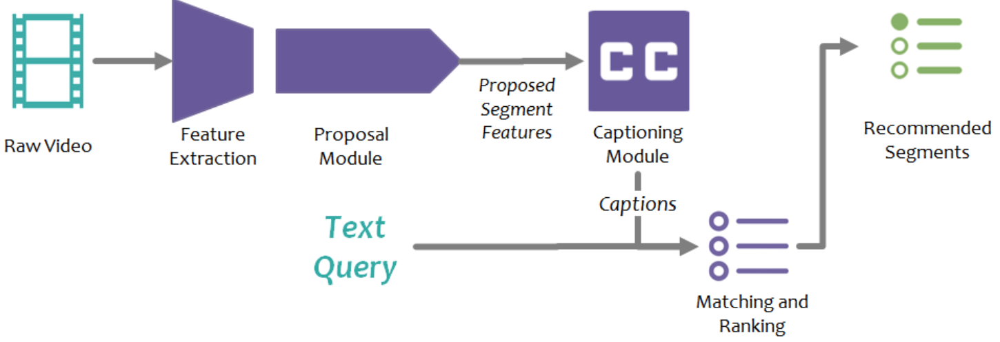
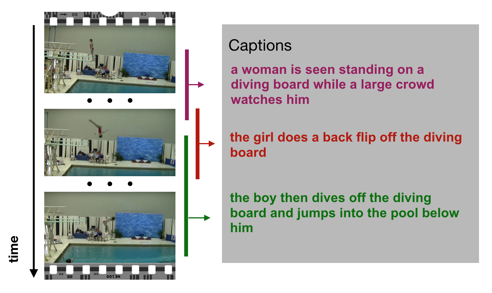
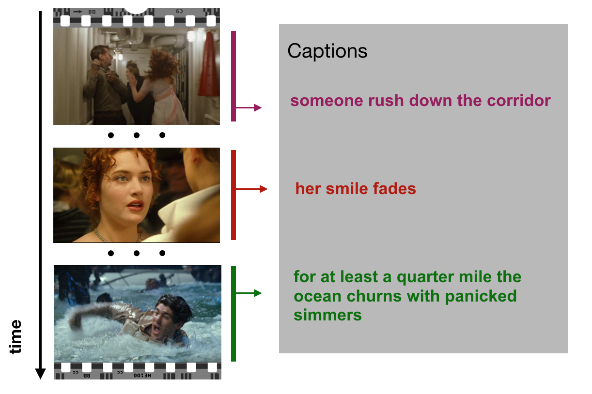

# Video Search using Natural Language (PyTorch)

In this research, we propose a framework for searching long untrimmed videos for segments that logically correlate with a natural language query. We develop a new method that exploits state-of-the-art deep learning models on the temporal-action-proposal task and dense captioning of events in videos to be able to retrieve video segments that corresponds to an input query in natural language.

To this end, we identify the following sub-problems: **Feature Extraction** to encode the raw visuals, **Temporal Action Proposal** to highlight important segments and thereby reducing the search space, **Dense-Video Captioning** for describing the video and S**entence Matching** to measure the semantic similarity with the generated captions in order to retrieve the desired segment(s).

You can find our research poster [here](resources/poster.pdf), and a video demo showing our results [here](https://www.youtube.com/watch?v=x0wArxjIlJ4). 

## Pipeline

## Modules
You can find the code for the following sub-projects in this repoistory.

### Feature Extraction

Extracting features from the raw visual information by learning the spatiotemporal relationships across the video using both 3D and 2D deep convolutional neural networks as feature extractors, pre-trained on the Sports-1M and the ImageNet datasets respectively, in order to represent motion and action (the temporal aspect) and appearance (the spatial aspect) simultaneously. 

### Temporal Action Proposal

This task focuses on generating temporal action proposals from long untrimmed video sequences efficiently in order to consider only segments that likely contain significant events, and thereby reducing the overall search space and avoid indexing irrelevant frames.

### Dense-Video Captioning

Describing videos by densely captioning the events in a given segment into natural language descriptions in order to have a common space between the original visuals and search queries. We experimented with two different models; a sequence-to-sequence model based on S2VT and a model with soft-attention mechanism to attend to relevant temporal information when generating different words. 

#### Example of Results

<table>
<tr>
<td align="center"></td>
<td align="center"></td>
</tr>
</table>

### Sentence Matching

Matching and ranking video segments that semantically correlate with search queries. We used a pre-trained Combine-Skip thought model to encode the captions generated by the captioning module and the user's input into vectors, in order to find the semantic similarity between them.

## Datasets

TBD

